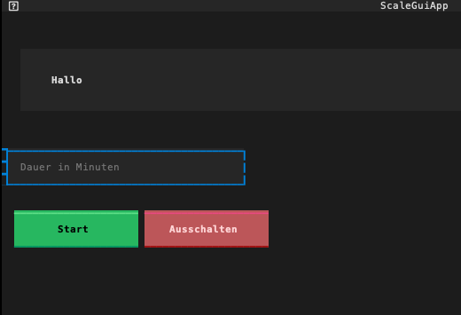
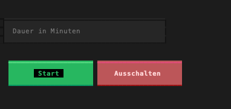

# Video Player

## How to start

- Connect HDMI Cable, Power Cable (with Power Button), Keyboard (USB-Stick)
- Optionally connect AUX audio cable
- Press button on power cable

The Raspberry Pi should start. If it works, you should see something like this:

## Functions

You can navigate with the arrow keys. Press down arrow to select "Start" or "Ausschalten".

Insert time as number. It sets the overall time of the playing video.
If the number is smaller than 10, it is automatically set to 10 minutes.

### Example

If you insert 30 minutes, then each stage of the video plays for 1 minute 30
seconds (30 : 20 = 1.5).

After 30 minutes, you should reach the last video (with the butterfly).
That video plays endlessly.

### Keyboard Functions During Video

- **N**: Next (switches to next video)
  - During the first five seconds of the video stages, the "transition" is shown.
  So you need to press twice to go to the next stage.
- **B**: Before (switches to previous video)
- **C**: Cancel (exit video and go back to start screen)
- **If nothing works**: Press Ctrl+Alt+Delete (Strg+Alt+Entf) or press power button
  - Restarts raspberry pi
  - Shouldn't be necessary in normal cases.
  - Might break something

### Keyboard Controls on Start Screen

- Use the arrow keys to switch between number field and buttons.
  - Up/Down, Left/Right
- Use keyboard to insert a number.
  - Only numbers, 2 hours is 120, not 2:00 or something.
- Use Enter to push a button.

Button is selected if it has the black background:

# Deutsch

## Starten

- Schließe das HDMI-Kabel, das Netzkabel (mit Netzschalter), die Tastatur (USB-Stecker) an.
- Optional: Verbinde ein AUX-Audiokabel.
- Drücke den Knopf am Netzkabel zum Starten.

Wenn alles funktioniert, solltest Du etwas Ähnliches wie das sehen:

## Funktionen

Du kannst mit den Pfeiltasten navigieren. Drücke die Pfeiltaste nach unten, um "Start" oder "Ausschalten" auszuwählen.

Geben die Zeit als Zahl ein. Das legt die Gesamtspielzeit des Videos fest.
Wenn die Zahl kleiner als 10 ist, wird sie automatisch auf 10 Minuten eingestellt.

## Beispiel

Wenn man 30 Minuten eingibt, spielt jede Stufe des Videos 1 Minute 30 Sekunden (30 : 20 = 1,5).

Nach 30 Minuten sollte das letzte Video erreicht sein (mit dem Schmetterling).
Dieses Video spielt endlos.
Tastaturfunktionen während des Videos

- **N**: Weiter (wechselt zum nächsten Video)
    - In den ersten fünf Sekunden der Videoabschnitte wird der "Übergang" angezeigt.
    Daher muss man zweimal drücken, um zum nächsten Abschnitt zu gelangen.
- **B**: Zurück (wechselt zum vorherigen Video)
- **C**: Abbrechen (Verlassen Sie das Video und kehren Sie zum Startbildschirm zurück)
- **Wenn nichts funktioniert**: Drücke Strg+Alt+Entf oder drücke die Ein-/Aus-Taste
    - Startet den Raspberry Pi neu
    - Sollte in normalen Fällen nicht erforderlich sein.
    - Könnte etwas beschädigen

## Tastensteuerung auf dem Startbildschirm

- Verwende die Pfeiltasten, um zwischen dem Zahlenfeld und den Schaltflächen zu wechseln.
    - Hoch/Runter, Links/Rechts
- Verwende die Tastatur, um eine Zahl einzugeben.
    - Nur Zahlen, 2 Stunden sind 120, nicht 2:00 oder ähnliches.
- Verwende die Eingabetaste, um eine Schaltfläche zu aktivieren.

Eine Schaltfläche ist ausgewählt, wenn sie einen schwarzen Hintergrund hat:

